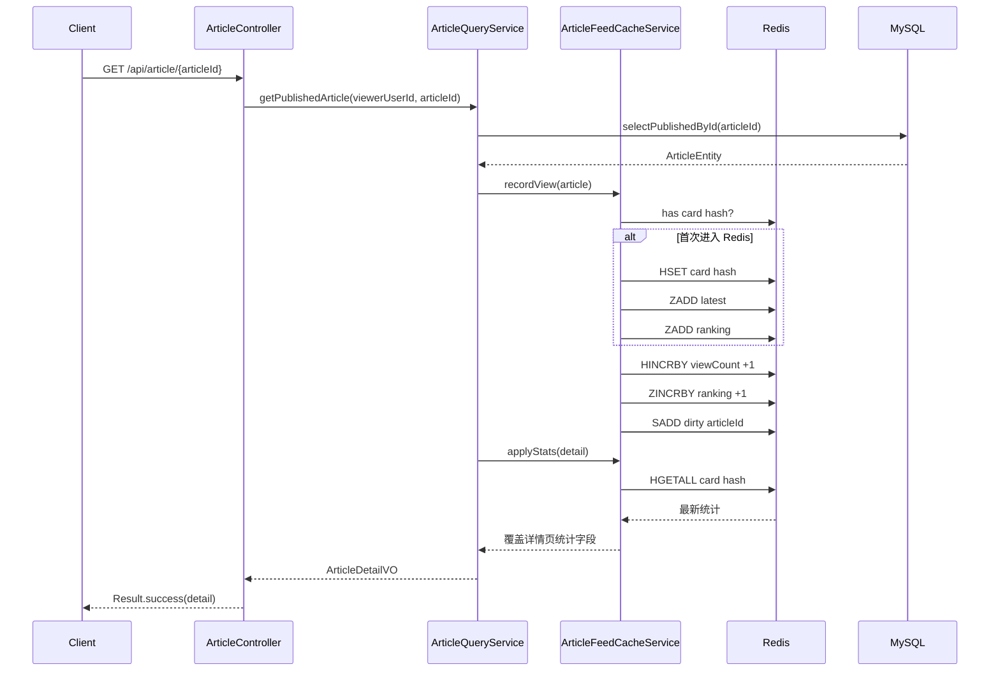
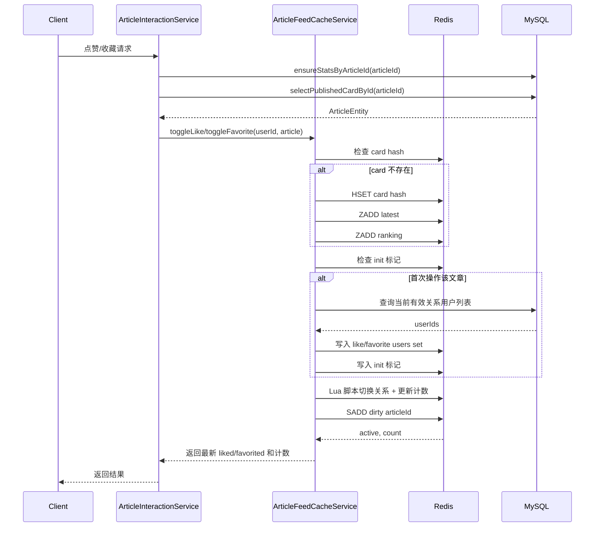
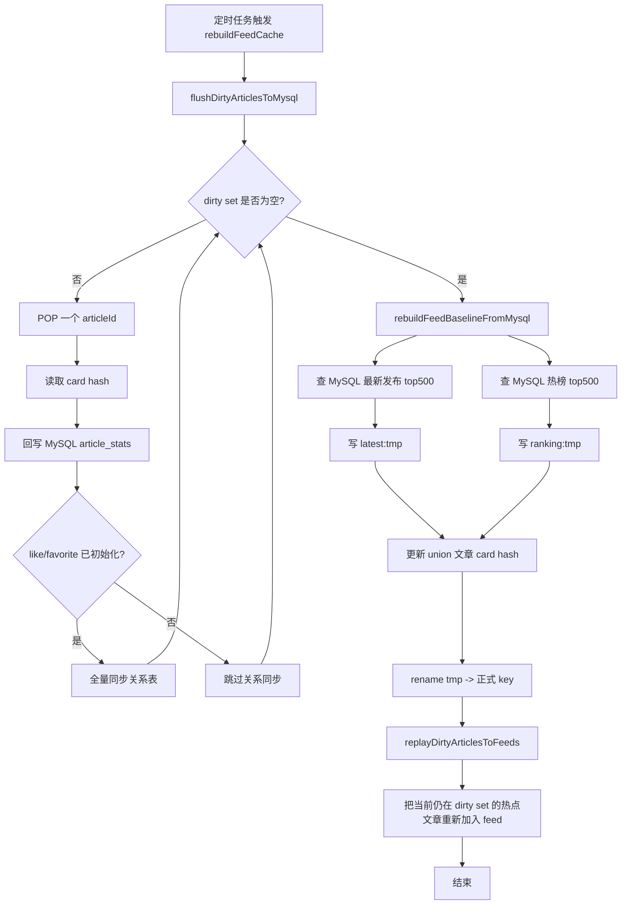
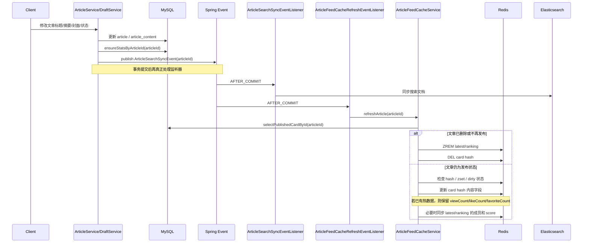

# Article Feed Redis 设计说明

本文整理当前项目中“文章首页 feed + 热数据缓存”的 Redis 设计，包含：

- Redis key 设计
- 卡片字段设计
- 读写规则
- 首页读取流程图
- 浏览命中、点赞收藏、定时回刷、文章编辑后的时序图

本文对应当前代码实现：

- `src/main/java/org/example/backend/service/core/article/impl/ArticleFeedCacheServiceImpl.java`
- `src/main/java/org/example/backend/service/core/article/impl/ArticleQueryServiceImpl.java`
- `src/main/java/org/example/backend/service/core/interaction/impl/ArticleInteractionServiceImpl.java`
- `src/main/java/org/example/backend/service/core/article/listener/ArticleFeedCacheRefreshEventListener.java`

## 1. 设计目标

这套方案的目标不是“把 MySQL 完全换成 Redis”，而是把首页展示和热数据更新拆成两层：

- MySQL:
  - 文章主数据主库
  - 定时回刷后的统计最终落库
  - feed 基线重建来源
- Redis:
  - 首页 feed 快速读取
  - 浏览量、点赞数、收藏数实时更新
  - 点赞/收藏关系缓存
  - 热文章的卡片摘要缓存

这样做的核心好处是：

- 首页列表优先走 Redis，读取更快
- 浏览、点赞、收藏可以实时更新，不必每次直打 MySQL
- 定时回刷把 Redis 热数据合并回 MySQL，保证最终一致
- 文章即使一开始不在 top500，只要被点击命中，也可以进入 Redis feed

## 2. Redis Key 设计

当前配置在 `application.yaml` 中，配置前缀为 `app.article-feed-cache`。

### 2.1 Key 一览

| Key | Redis 类型 | 示例 | 用途 |
| --- | --- | --- | --- |
| `article:feed:latest` | `ZSET` | `article:feed:latest` | 首页按发布时间排序的 feed |
| `article:feed:ranking` | `ZSET` | `article:feed:ranking` | 首页按浏览量排序的 feed |
| `article:feed:card:{articleId}` | `HASH` | `article:feed:card:1001` | 文章卡片信息和实时统计 |
| `article:feed:like:users:{articleId}` | `SET` | `article:feed:like:users:1001` | 点赞用户集合 |
| `article:feed:favorite:users:{articleId}` | `SET` | `article:feed:favorite:users:1001` | 收藏用户集合 |
| `article:feed:like:init:{articleId}` | `STRING` | `article:feed:like:init:1001` | 点赞集合是否已经从 MySQL 初始化过 |
| `article:feed:favorite:init:{articleId}` | `STRING` | `article:feed:favorite:init:1001` | 收藏集合是否已经从 MySQL 初始化过 |
| `article:feed:dirty` | `SET` | `article:feed:dirty` | 待回刷到 MySQL 的脏文章集合 |
| `article:feed:latest:tmp` | `ZSET` | `article:feed:latest:tmp` | 定时重建时的最新流临时 key |
| `article:feed:ranking:tmp` | `ZSET` | `article:feed:ranking:tmp` | 定时重建时的热榜临时 key |

### 2.2 两个 ZSET 的 score 语义

#### `article:feed:latest`

- member: `articleId`
- score: `publishedAt` 对应的毫秒时间戳
- 用途:
  - 首页最新发布排序
  - 5 分钟重建时，从 MySQL 取发布时间倒序前 `maxItems`

#### `article:feed:ranking`

- member: `articleId`
- score: 当前浏览量
- 用途:
  - 首页热榜排序
  - 浏览命中时用 `ZINCRBY` 实时增加 score
  - 5 分钟重建时，从 MySQL 取浏览量倒序前 `maxItems`

### 2.3 为什么要有 `card hash`

如果只存 `ZSET`，Redis 里只有 `articleId` 和 `score`，还要再回 MySQL 查标题、摘要、封面、点赞数等字段。

所以这里额外为每篇热文章维护一个 `HASH`，作为首页卡片的聚合缓存，避免列表渲染时多次查库。

## 3. 卡片字段设计

`article:feed:card:{articleId}` 当前包含这些字段：

| 字段 | 含义 | 来源 |
| --- | --- | --- |
| `articleId` | 文章 ID | MySQL |
| `userId` | 作者 ID | MySQL |
| `title` | 标题 | MySQL |
| `summary` | 摘要 | MySQL |
| `coverUrl` | 封面 | MySQL |
| `viewCount` | 浏览量 | Redis 热更新，定时回刷 |
| `likeCount` | 点赞数 | Redis 热更新，定时回刷 |
| `favoriteCount` | 收藏数 | Redis 热更新，定时回刷 |
| `publishedAt` | 发布时间 | MySQL |
| `updatedAt` | 更新时间 | MySQL |

### 3.1 字段一致性规则

字段不是一律同源，而是分成两类：

- 内容字段以 MySQL 为准：
  - `title`
  - `summary`
  - `coverUrl`
  - `publishedAt`
  - `updatedAt`
- 热度字段在 Redis 中实时更新：
  - `viewCount`
  - `likeCount`
  - `favoriteCount`

因此在刷新卡片时，不是简单整块覆盖，而是：

- 普通重建场景:
  - 可以直接用 MySQL 值重建卡片
- 文章已在 Redis 中并且存在脏热数据时:
  - 更新内容字段
  - 保留 Redis 中实时热度字段

这就是当前实现里 `upsertCardHash(article, preserveHotCounts)` 的意义。

## 4. 读写总规则

### 4.1 首页列表读取规则

- 仅当 `authorUserId == null` 且排序为 `desc` 时，优先走 Redis feed
- `sortBy = publishedAt` 时读取 `latest` zset
- `sortBy = viewCount` 时读取 `ranking` zset
- 拿到 `articleId` 后，再从 `card hash` 组装卡片
- Redis 未命中或无结果时，回退 MySQL 分页查询

### 4.2 浏览命中规则

- 文章详情页被查看时，先查 MySQL 拿到文章
- 之后调用 `recordView(article)`
- 如果文章还没有进 Redis：
  - 写入 `card hash`
  - 加入 `latest` 和 `ranking`
- 同时：
  - `viewCount` 在 hash 中 `HINCRBY`
  - `ranking` 的 score `ZINCRBY`
  - 文章 ID 加入 `dirty set`

### 4.3 点赞 / 收藏规则

- 接口先确认文章为已发布状态
- 然后走 Redis-first 切换
- 第一次操作某篇文章时：
  - 先从 MySQL 加载当前有效的点赞/收藏用户集合
  - 写入对应 `SET`
  - 写入初始化标记 key
- 之后每次切换：
  - 修改关系集合
  - 修改 `card hash` 中的计数字段
  - 将文章加入 `dirty set`

### 4.4 文章编辑规则

- 文章标题、摘要、封面等先写 MySQL
- 事务提交后触发 `ArticleSearchSyncEvent`
- 搜索同步监听器处理 ES
- Feed 缓存监听器调用 `refreshArticle(articleId)`
- `refreshArticle` 会：
  - 若文章不再可发布，则从 Redis feed 和 card 中移除
  - 若文章仍存在，则更新卡片字段
  - 如果文章已在 feed 中或有资格进入 feed，则同步更新两个 ZSET
  - 如果 Redis 里已有热数据，保留当前热度字段

### 4.5 五分钟定时回刷规则

定时任务每 5 分钟执行一次，分三步：

1. 把 `dirty set` 中的文章热数据刷回 MySQL
2. 用 MySQL 当前结果重建 top500 的 `latest/ranking`
3. 把本轮仍然是脏的热点文章重新回放到 Redis feed

这样做是为了兼顾：

- MySQL 作为最终统计存储
- Redis 作为实时热数据存储
- 首页 feed 周期性对齐数据库基线

## 5. 首页列表读取流程图

```mermaid
flowchart TD
    A[请求首页文章列表] --> B{authorUserId 为空且 sortOrder=desc?}
    B -- 否 --> C[直接查 MySQL 分页]
    B -- 是 --> D{sortBy 是什么?}
    D -- publishedAt --> E[读取 article:feed:latest]
    D -- viewCount --> F[读取 article:feed:ranking]
    E --> G[按分页区间拿 articleId]
    F --> G
    G --> H{Redis 取到 articleId?}
    H -- 否 --> C
    H -- 是 --> I[逐个读取 article:feed:card:{articleId}]
    I --> J{card hash 缺失?}
    J -- 是 --> K[回 MySQL 查文章卡片并补写 Redis]
    J -- 否 --> L[组装 ArticleSummaryVO]
    K --> L
    L --> M[补 liked/favorited 状态]
    M --> N[返回列表结果]
    C --> O[补 Redis 统计并补 liked/favorited 状态]
    O --> N
```

## 6. 浏览命中时序图



## 7. 点赞 / 收藏时序图



## 8. 五分钟定时回刷流程图



## 9. 文章编辑后的时序图



## 10. 当前实现的关键判断点

### 10.1 哪些文章会进入 Redis feed

文章进入 Redis feed 的来源有两种：

- 定时重建时，MySQL 排名前 `maxItems` 的文章进入 Redis
- 非 top500 文章如果被详情页点击命中，也会即时加入 Redis feed

当前不做的事：

- 搜索命中不会自动把文章加入 feed

### 10.2 为什么还要保留 MySQL 分页回退

Redis feed 只覆盖“首页核心展示”和“热文章集合”，并不适合替代所有列表查询。

所以：

- 个人文章列表仍然主要靠 MySQL
- 指定作者过滤列表仍然主要靠 MySQL
- Redis 只在“首页公共流 + 倒序排序”场景优先使用

### 10.3 为什么定时回刷后还要 replay dirty articles

如果定时任务在执行期间，刚好又有新的浏览、点赞、收藏写入 Redis，会出现：

- baseline 已经按旧快照重建完成
- 但新热点还没并入 zset

所以最后还要执行一次 `replayDirtyArticlesToFeeds`，把这些脏热点重新塞回 feed，避免漏掉。

## 11. 配置项说明

当前配置如下：

```yaml
app:
  article-feed-cache:
    latest-zset-key: article:feed:latest
    ranking-zset-key: article:feed:ranking
    card-hash-key-prefix: article:feed:card:
    like-user-set-key-prefix: article:feed:like:users:
    favorite-user-set-key-prefix: article:feed:favorite:users:
    like-init-key-prefix: article:feed:like:init:
    favorite-init-key-prefix: article:feed:favorite:init:
    dirty-article-set-key: article:feed:dirty
    max-items: 500
    rebuild-interval-ms: 300000
```

含义：

- `max-items`:
  - 定时重建时，从 MySQL 拉多少篇文章作为基线
- `rebuild-interval-ms`:
  - 多久执行一次回刷和重建
- 各类 `prefix`:
  - 用于区分不同业务 key，避免冲突

## 12. 可继续优化的方向

- 增加 `updatedAt` 或版本号判断，进一步避免旧刷新覆盖新缓存
- 给 `card hash` 增加过期策略或后台清理策略
- 为 `dirty set` 增加更细粒度监控，例如：
  - 当前脏文章数量
  - 单轮回刷耗时
  - 回刷失败重试次数
- 如果未来要引入“热度综合分”，可以把 `ranking` 的 score 从纯浏览量扩展成加权分值

## 13. 一句话总结

当前文章 feed 方案可以概括为：

- MySQL 负责主数据和最终落库
- Redis 用两个 `ZSET` 管首页顺序
- Redis 用 `HASH` 管卡片摘要和实时统计
- Redis 用 `SET` 管点赞/收藏关系
- 浏览、点赞、收藏先打 Redis
- 每 5 分钟回刷 MySQL 并重建 feed 基线
- 文章被编辑后，通过事务后事件同步刷新 Redis 卡片和 feed 状态
